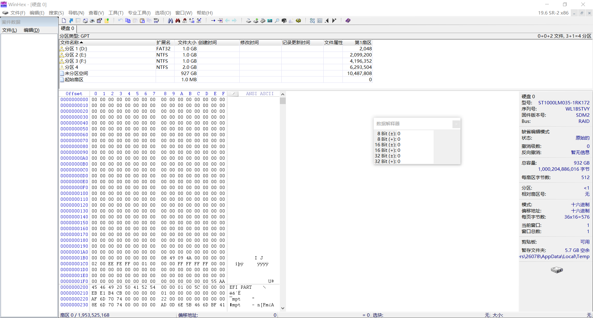

# 【数据恢复】笔记

[toc]

## 存储格式

大头位序（Big-endian）：高位在左，低位在右
	文件系统：HFS

小头位序（Little-endian）：低位在左，高位在右
	文件系统：FAT32、NTFS、exFAT

## WinHex

字节（Byte，B）

1行 = 16B
1扇区 = 32行 = 512B
1KB = 2扇区 = 1024B

## 文件系统

文件系统：
	FAT32（File Allocation Table）
	NTFS（New Technology File System）
	exFAT（Extended File Allocation Table）

## FAT32

FAT32文件系统结构：
	DBR：系统引导扇区
	保留区
	FAT1
	FAT2
	数据区

### DBR

| 偏移（十六进制） | 字节数 |             描述             |
| :--------------: | :----: | :--------------------------: |
|      00~02       |   3    |           跳转指令           |
|      03~0A       |   8    |         文件系统版本         |
|      0B~0C       |   2    |         每扇区字节数         |
|        0D        |   1    |          每簇扇区数          |
|      0E~0F       |   2    |          保留扇区数          |
|        10        |   1    |          FAT表个数           |
|      11~12       |   2    |           FAT32：0           |
|      13~14       |   2    |           FAT32：0           |
|        15        |   1    |          介质描述符          |
|      16~17       |   2    |           FAT32：0           |
|      18~19       |   2    |         每磁道扇区数         |
|      1A~1B       |   2    |            磁头数            |
|      1C~1F       |   4    | 隐含扇区数：扇区0到DBR的扇区 |
|      20~23       |   4    |       文件系统总扇区数       |
|      24~27       |   4    |     每个FAT表占用扇区数      |
|      28~29       |   2    |       标记：FAT32特有        |
|      2A~2B       |   2    |    FAT32版本号：FAT32特有    |
|                  |        |                              |
|                  |        |                              |
|                  |        |                              |

看到：1.FAT32文件系统数据结构
